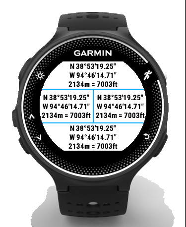

Brandon’s Garmin Apps
=====================

This small repository holds a few apps that I am attempting to write,
in the hopes of outfitting my Garmin Forerunner 230
with the ability to display latitude and longitude
during long backcountry hikes.
After installing the Garmin SDK,
you can try one of the apps out with:

    (in one terminal:)
    $ connectiq

    (in another terminal):
    $ cd brandon-garmin
    $ ./LatLonField/build.sh

The result should be a data field that,
in the small area allocated to it,
fits in the latitude, longitude, and elevation:

